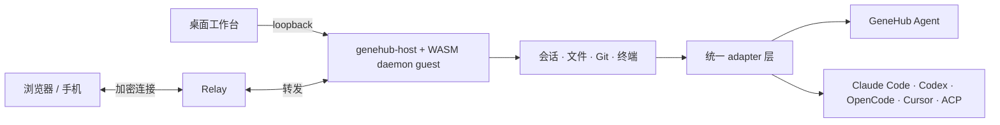

# GeneHub

**让 coding agent 留在你的机器上，却能跟你去任何设备。**

GeneHub 是一个开源、local-first 的 coding agent 工作台。它把你的电脑变成一台持续在线的开发机器：
在桌面前开始任务，离开后用浏览器或手机继续；换设备不换项目，不丢会话，也不必把工作区搬进某个云端沙箱。

[快速开始](#快速开始) · [为什么做 GeneHub](#为什么做-genethub) · [项目理念](#愿景与理念) · [架构](#它如何工作) ·
[本地开发](#本地开发) · [自建](./docs/self-hosting.md) · [安全模型](./docs/security-model.md)

> 发布平台：Windows x64 桌面端 · Linux x64 daemon/CLI · macOS 源码构建

## 为什么做 GeneHub

| 开发者的痛点 | GeneHub 的方案 |
| --- | --- |
| Agent 被绑在一台电脑的一个终端或 IDE 里，离开座位就失去控制 | 常驻 daemon 持有任务与会话；桌面、浏览器和手机使用同一份工作台 |
| Claude Code、Codex、OpenCode、Cursor 等各有协议、事件和恢复方式 | adapter 把它们归一化为同一套会话、时间线和能力模型 |
| 远程使用高权限开发工具，往往意味着暴露端口或把代码环境交给第三方 | daemon 只监听本机并主动建立远程连接；业务内容加密后再中转 |
| 更换 agent、模型或设备后，项目上下文与操作入口随之碎片化 | 工作区、文件、Git、终端、会话和 agent 选择集中在一个工作台里 |
| 远程能力被绑定在厂商账号和云服务上，想退出就得换工具或搬数据 | 官方 Hub 开箱即用，也可以自行部署开源 Relay 与工作台；项目和会话仍留在自己的机器上 |

## 现在可以做什么

- 使用随安装包提供的 **GeneHub Agent**，或自动接入本机已有的 **Claude Code、Codex、OpenCode、Cursor** 和其他 ACP agent。
- 从任意已授权设备创建、恢复和切换会话；客户端断线时任务继续在资源电脑上运行。
- 在同一界面浏览项目文件、查看 Git 变更、使用终端，并预览 agent 生成的 Markdown、图片、HTML 和视频。
- 为不同会话选择 agent、模型、思考强度和权限模式；界面只展示对应 agent 真正支持的能力。
- 使用官方 Hub 完成跨设备接力，或者完全自建 Relay 与工作台。

GeneHub Agent 随安装包提供，配置 Anthropic 或 OpenAI-compatible 模型服务后即可使用。
第三方 agent 需先按各自方式安装和登录，GeneHub 会自动检测并把它们加入选择器。

## 愿景与理念

> **把你所有的机器变成一台，把你所有的 Agent 变成一个能对话的人——算力和作品都留在你自己手里。**

我们相信两件事：模型每隔几个月强一次，而人打字的速度从未变过，**人机之间的带宽会取代模型能力成为
主要瓶颈**；同时，未发布的作品、商业软件许可、本地模型与外设、已经买下的硬件都长在端侧，
**端侧生产力生态不会被 cloud-only 取代**。

由此产品分三层，顺序不能颠倒：**拥有**（工作区、密钥、进程和会话记录都在你自己的设备上）→
**汇聚**（你的机器和 Agent 汇聚成一个可指挥的整体，多一台机器换来的是产能而不只是一个入口）→
**带宽**（作品本身成为界面，你点、你选、你说，而不是把体验翻译成文字）。

四条承诺，每条都能被验收：

1. **资产不动。** 工作区、密钥、进程和会话记录由你的机器持有；远端设备只是经过授权的操作界面。
2. **多机是常态。** 本机只是目录里延迟最低、断网也在的那一项，不是唯一的一等目标。
3. **Agent 可替换。** daemon 和前端只认统一协议，不把任何一家 agent 的私有事件格式变成产品协议；
   你已经付费和熟悉的 agent 是一等公民。
4. **会话跟着人。** 关掉页面、切换网络或换一台设备，都不该终止正在机器上执行的任务，回来还能接上。

两条工程纪律支撑上面四条：**信任来自可核对的边界**——数据存在哪里、远程连接经过什么组件、设备如何
获得授权，都写在代码和文档里，开源侧不依赖官方服务也能独立部署；**业务更新不该变成用户的安装任务**
——目标是 95% 的产品 change set 只更新 WASM guest 与工作台，official 分钟级、beta/alpha/dev 秒级，
后台验签、切换和失败回滚。当前 Linux/dev 运行时底座已验证，Windows owner-only ACL 与自动交付链仍在
[roadmap](./docs/roadmap.md) 推进；在测量系统建立之前，95% 与分钟级都是目标而不是已达成的状态。

## 快速开始

### Windows：桌面端

1. 从 [GitHub Releases](https://github.com/aikenc/genethub/releases/latest) 下载最新的 Windows 安装包与
   `SHA256SUMS`，核对摘要后安装。
2. 启动 GeneHub。桌面工作台会自动连接本机 daemon；关闭窗口后，daemon 仍由托盘保持运行。
3. 打开一个项目，在「设置」中配置模型服务，或者选择已经安装并登录的第三方 agent。
4. 新建会话，直接描述你想完成的任务。需要从手机或另一台电脑继续时，再开启远程连接并打开生成的链接。

### Linux / 服务器：daemon + 浏览器

当前预编译包支持 Linux x64，使用 musl 静态链接，不依赖宿主机的 glibc 版本：

```bash
curl --proto '=https' --proto-redir '=https' --max-redirs 5 --globoff -fsSL \
  https://relay.genethub.com/install.sh | sh

# 如果 ~/.local/bin 尚未在 PATH 中
export PATH="$HOME/.local/bin:$PATH"

genet daemon start
genet hub login --wait
```

在浏览器中打开 `genet hub login` 打印的地址并按页面提示完成连接。进入工作台后：

1. 打开工作区（一个文件夹，或 `.code-workspace` 描述的多文件夹工作区）；全新安装也会先准备一个可用的默认工作区。
2. 在「设置」中填入模型 API Key，或选择本机已登录的第三方 agent。
3. 新建会话并发送第一条任务。

常用诊断与接力命令：

```bash
genet status          # 版本、channel、daemon 与 Hub 状态
genet hub link        # 为另一台设备生成一次性连接链接
genet daemon stop     # 停止后台 daemon
```

安装脚本会安装薄 CLI `genet`、原生装载壳 `genehub-host` 和同时承载 daemon/agent 两个入口的
`genehub_guest.wasm`，并在下载后强制校验 `SHA256SUMS`。业务只跑在这份 WASM 里：没有原生
daemon/agent 模式，缺件或不匹配直接失败，不会回退。**当前**升级仍需从
[GitHub Releases](https://github.com/aikenc/genethub/releases/latest) 下载新版本并核对摘要；独立签名根、
组件自动更新与回滚落地前，不会把摘要校验描述成安全的无感更新。

### macOS

macOS 桌面端代码和进程监督测试已经存在，但公开安装包要等签名与公证完成后再发布。现在请按
[本地开发](#本地开发) 的步骤从源码构建。

## 它如何工作



| 部件 | 职责 |
| --- | --- |
| **daemon guest**（Rust → WASM Component） | 机器上的常驻业务运行时；管理工作区、会话、文件、Git、终端、设备授权，并按需拉起 agent |
| **native host / CLI**（Rust） | Wasmtime/WASI 与 OS/连接资源、daemon 生命周期、薄 argv 转发；不解释产品动词 |
| **adapter**（Rust） | 探测不同 agent，把它们的协议、事件和能力翻译成 GeneHub 的统一模型 |
| **Relay**（Node.js） | 为跨设备连接转发加密数据；不解析业务内容，也不保存 GeneHub 会话 |
| **workbench**（React） | 同一份前端运行在桌面 WebView、浏览器和手机上 |

同机连接只走 `127.0.0.1`。跨设备时，工作台通过 Relay 找到 daemon；网络条件允许时可使用
WebRTC 直连。无论从桌面、浏览器还是手机进入，看到的都是同一份工作台和同一批会话。

更完整的分层、协议与约束见 [架构文档](./docs/architecture.md)。

## 数据与远程访问

- 工作区文件、模型服务凭证、进程和 GeneHub 会话记录保存在运行 daemon 的机器上。
- 同机使用只经过 `127.0.0.1`；跨设备连接的业务内容会先加密，再交给 Relay 转发。
- 新设备从已授权端获得一条短期连接链接；在浏览器或 App 中打开、扫码后即可继续使用。
- 使用模型服务时，完成任务所需的请求内容会发送给你配置的服务；本机第三方 agent 则按各自配置工作。
- 官方 Hub 用于账号登录、机器发现和远程路由；完全自建时不需要官方账号系统。

需要评估具体威胁模型、可见元数据、凭证生命周期或部署敏感代码时，请阅读
[安全模型](./docs/security-model.md) 与 [端到端数据通道](./docs/e2ee-data-plane.md)。

## 自建

GeneHub 的开源形态不依赖官方账号系统。最小远程部署由三部分组成：

```text
资源电脑上的 daemon  +  无状态 Relay  +  HTTPS 静态工作台
```

设备授权由 daemon 管理，Relay 只负责让两端建立连接。完整的部署、TLS、配对和运维说明见
[self-hosting.md](./docs/self-hosting.md)。

## 本地开发

### 环境要求

- 当前 stable Rust toolchain
- Node.js 22 与 npm
- Git
- 构建桌面端时，还需要 Tauri 2 对应平台的系统依赖；桌面壳仅面向 Windows 与 macOS

### 拉取与构建

```bash
git clone https://github.com/aikenc/genethub.git
cd genethub

# 原生 launcher/host，以及单平台 WASM guest
cargo build -p genet-cli -p genehub-host
cargo build --release -p genehub-guest --target wasm32-wasip2

# Web workbench 与 Relay
npm ci --prefix packages/workbench
npm ci --prefix apps/relay
npm --prefix packages/workbench run build
npm --prefix apps/relay run build
```

源码树始终使用隔离的 `dev` channel：构建出的原生入口是 `genet-dev` / `genehub-host-dev`，业务制品是
`genehub_guest.wasm`，版本为 `0.0.0`，并且**没有默认 Hub 地址**。这是为了避免本地开发意外读写
正式版的数据或连到正式服务。

```bash
./target/debug/genet-dev daemon start
./target/debug/genet-dev status

# 需要测试远端流程时，显式指定与你的构建匹配的 Hub
./target/debug/genet-dev hub login --hub https://your-hub.example --wait
```

不要直接执行仓库里的 `scripts/install.sh` 来安装正式版：源码中的脚本同样属于 `dev` channel，会有意拒绝下载。
正式版请使用[快速开始](#快速开始)中的发布入口。

### 测试

```bash
# 旅程测试会拉起真实 launcher/host/guest，所以先构建三件套
cargo build -p genet-cli -p genehub-host
cargo build --release -p genehub-guest --target wasm32-wasip2
cargo test --workspace --no-fail-fast

npm --prefix apps/relay run typecheck
npm --prefix apps/relay test

npm --prefix packages/workbench run typecheck
npm --prefix packages/workbench test
npm --prefix packages/workbench run build
```

Windows 或 macOS 上构建桌面安装包：

```bash
npm ci --prefix apps/desktop
node apps/desktop/scripts/bundle.mjs
```

协议变更、真实第三方 agent、桌面监督与全栈旅程的门禁见 [testing.md](./docs/testing.md)。

### 仓库结构

| 路径 | 内容 |
| --- | --- |
| `apps/cli` | `genet` 薄 CLI，以及启动/管理 daemon 的原生入口 |
| `apps/host` | Wasmtime/WASI 壳与 typed OS/RTC 连接资源 |
| `apps/guest` | `genehub_guest.wasm` 的 daemon/agent 双入口 |
| `apps/daemon` | 编入 guest 的会话内核、adapter、工作区能力和本地/远端传输 |
| `apps/agent` | 编入同一 guest 的 GeneHub Agent |
| `apps/relay` | 无状态 Fabric Relay |
| `apps/desktop` | Windows/macOS Tauri 2 桌面壳 |
| `packages/proto` | Rust 协议定义及生成的 TypeScript bindings |
| `packages/workbench` | 浏览器、桌面和手机共用的工作台 |
| `testing` | 跨部件旅程、安装与安全边界测试 |

## 继续阅读

| 文档 | 适合什么时候读 |
| --- | --- |
| [architecture.md](./docs/architecture.md) | 理解顶层分层、不可让步的边界和演进顺序 |
| [engineering-guidance.md](./docs/engineering-guidance.md) | 动手之前：这个方案该长什么形状 |
| [engineering-laws.md](./docs/engineering-laws.md) | 实现与提交之前：哪些事不许做 |
| [third-party-agents.md](./docs/third-party-agents.md) | 接入 Claude Code、Codex、OpenCode、Cursor 或自定义 ACP agent |
| [daemon.md](./docs/daemon.md) | 修改会话内核、工作区、设备、传输或存储 |
| [web-workbench.md](./docs/web-workbench.md) | 修改工作台、宿主适配与移动端体验 |
| [relay.md](./docs/relay.md) | 部署或开发 Fabric Relay |
| [self-hosting.md](./docs/self-hosting.md) | 自建完整的远程访问闭环 |
| [security-model.md](./docs/security-model.md) | 评估信任边界、凭证、撤销和已知限制 |
| [testing.md](./docs/testing.md) | 选择受影响的测试与端到端门禁 |
| [roadmap.md](./docs/roadmap.md) | 查看已经落地、正在推进和明确不做的能力 |

如果你准备修改协议或跨部件行为，请先读 `architecture.md` 确认边界，按 `engineering-guidance.md`
形成方案，实现时对照 `engineering-laws.md`，最后运行对应窄测试与 `testing.md` 中的门禁。
问题、设计讨论和功能建议可以提交到 [GitHub Issues](https://github.com/aikenc/genethub/issues)。

## License

[AGPL-3.0-or-later](./LICENSE)，整仓一致。
