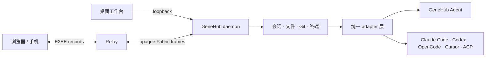

# GeneHub

**让 coding agent 留在你的机器上，却能跟你去任何设备。**

GeneHub 是一个开源、local-first 的 coding agent 工作台。它把你的电脑变成一台持续在线的开发机器：
在桌面前开始任务，离开后用浏览器或手机继续；换设备不换项目，不丢会话，也不必把工作区搬进某个云端沙箱。

[快速开始](#快速开始) · [项目理念](#愿景与理念) · [架构](#它如何工作) ·
[本地开发](#本地开发) · [自建](./docs/self-hosting.md) · [安全模型](./docs/security-model.md)

> 当前公开发布支持 Windows x64 桌面端与 Linux x64 daemon/CLI；macOS 可从源码构建，正式安装包仍在等待签名与公证。

## 愿景与理念

我们希望 coding agent 像 Git 和 SSH 一样，成为开发者**可以拥有、可以替换、可以自建**的基础设施，
而不是被锁在某个终端、编辑器或云平台里的一次性对话。

GeneHub 的设计遵循五条原则：

1. **机器是事实来源。** 工作区、密钥、进程和会话记录由你的机器持有；远端设备只是经过授权的操作界面。
2. **Agent 是插件。** daemon 和前端只认统一协议，不把任何一家 agent 的私有事件格式变成产品协议。
3. **会话应当跟着人，而不是跟着窗口。** 关掉页面、网络切换或换一台设备，都不该终止正在机器上执行的任务。
4. **开源版本必须自成闭环。** daemon、Relay 和静态工作台可以独立部署；自建远程访问不依赖官方账号或数据库。
5. **安全边界必须说清楚。** Relay 的可见范围、模型服务会收到什么、当前密码学还缺什么，都应当能在代码和文档中核对。

## 为什么做 GeneHub

| 开发者的痛点 | GeneHub 的方案 |
| --- | --- |
| Agent 被绑在一台电脑的一个终端或 IDE 里，离开座位就失去控制 | 常驻 daemon 持有任务与会话；桌面、浏览器和手机使用同一份工作台 |
| Claude Code、Codex、OpenCode、Cursor 等各有协议、事件和恢复方式 | adapter 把它们归一化为同一套会话、时间线和能力模型 |
| 远程使用高权限开发工具，往往意味着暴露端口或把代码环境交给第三方 | daemon 只监听 loopback，并主动连出；跨设备业务数据经过端到端加密的 Fabric 转发 |
| 更换 agent、模型或设备后，项目上下文与操作入口随之碎片化 | 工作区、文件、Git、终端、会话和 agent 选择集中在一个工作台里 |
| 自托管产品常常仍暗中依赖官方控制面 | 自建形态只需要无状态 Relay 与静态工作台，不需要账号服务或数据库 |

### 现在可以做什么

- 使用随安装包提供的 **GeneHub Agent**，或自动接入本机已有的 **Claude Code、Codex、OpenCode、Cursor** 和其他 ACP agent。
- 从任意已授权设备创建、恢复和切换会话；客户端断线时任务继续在资源电脑上运行。
- 在同一界面浏览项目文件、查看 Git 变更、使用终端，并预览 agent 生成的 Markdown、图片、HTML 和视频。
- 为不同会话选择 agent、模型、思考强度和权限模式；界面只展示对应 agent 真正支持的能力。
- 使用官方 Hub 完成跨设备接力，或者完全自建 Relay 与工作台。

外部 agent 不随 GeneHub 分发。它们只有在已经安装并完成各自登录后才会出现在选择器中；
没有外部 agent 时，内置 GeneHub Agent 仍可使用你配置的 Anthropic 或 OpenAI-compatible 模型服务。

## 快速开始

### Windows：桌面端

1. 从 [GitHub Releases](https://github.com/aikenc/genethub/releases/latest) 下载最新的 Windows 安装包与
   `SHA256SUMS`，核对摘要后安装。
2. 启动 GeneHub。桌面工作台会通过 loopback 自动连接本机 daemon；关闭窗口后，daemon 仍由托盘保持运行。
3. 打开一个项目，在「设置」中配置模型服务，或者选择已经安装并登录的第三方 agent。
4. 新建会话，直接描述你想完成的任务。需要从手机或另一台电脑继续时，再开启远程连接并打开生成的链接。

### Linux / 服务器：daemon + 浏览器

当前预编译包支持 Linux x64，使用 musl 静态链接，不依赖宿主机的 glibc 版本：

```bash
curl --proto '=https' --proto-redir '=https' --max-redirs 5 --globoff -fsSL \
  https://relay.genethub.com/install.sh | sh

# 如果 ~/.local/bin 尚未在 PATH 中
export PATH="$HOME/.local/bin:$PATH"

genet daemon start
genet hub login --wait
```

在浏览器中打开 `genet hub login` 打印的地址并按页面提示完成连接。进入工作台后：

1. 打开项目目录；全新安装也会先准备一个可用的默认工作区。
2. 在「设置」中填入模型 API Key，或选择本机已登录的第三方 agent。
3. 新建会话并发送第一条任务。

常用诊断与接力命令：

```bash
genet status          # 版本、channel、daemon 与 Hub 状态
genet hub link        # 为另一台设备生成一次性连接链接
genet daemon stop     # 停止后台 daemon
```

安装脚本会同时安装 `genet`（CLI 与 daemon 是同一个二进制）和 `genet-agent`，并在下载后强制校验
`SHA256SUMS`。当前没有自动下载安装更新的入口；升级请继续从官方发布页手动完成。

### macOS

macOS 桌面端代码和进程监督测试已经存在，但公开安装包要等签名与公证完成后再发布。现在请按
[本地开发](#本地开发) 的步骤从源码构建。

## 它如何工作



| 部件 | 职责 |
| --- | --- |
| **daemon**（Rust） | 机器上的唯一常驻进程；管理工作区、会话、文件、Git、终端、设备授权，并按需拉起 agent |
| **adapter**（Rust） | 探测不同 agent，把它们的协议、事件和能力翻译成 GeneHub 的统一模型 |
| **Relay**（Node.js） | 在跨设备连接中转发 opaque Fabric 帧；不解析 E2EE 业务 payload，不保存会话 |
| **workbench**（React） | 同一份前端运行在桌面 WebView、浏览器和手机上 |

同机连接只走 `127.0.0.1`。跨设备连接先建立 WSS Fabric baseline；网络允许时，新请求可以优先走
WebRTC DataChannel。无论使用哪条远端 carrier，客户端看到的都是同一个 protocol-v3 `DataEndpoint`。

更完整的分层、协议与约束见 [架构文档](./docs/architecture.md)。

## 数据与安全边界

- 工作区文件、provider 凭证、进程和 GeneHub 会话记录保存在 daemon 所在机器上。
- 你选择的模型服务或第三方 agent 仍会收到完成请求所需的提示与代码上下文；GeneHub 不会把“本地存储”宣传成“模型看不到数据”。
- 远端 peer 完成 PSK 双向证明后，业务 record 使用 AES-256-GCM，并绑定方向、序号与 AAD。
- Relay 能看到 IP、连接时间、路由 handle、帧长度与时序，以及初始有界 peer hello；它看不到握手后的 RPC、文件路径、终端内容或模型对话正文。
- 当前 PSK 方案尚无前向保密；托管 Control 参与 peer secret 的签发，因此 GeneHub 也不宣称“整个平台零知识”。

部署到公网、评估威胁模型或处理敏感代码前，请完整阅读
[security-model.md](./docs/security-model.md) 与 [e2ee-data-plane.md](./docs/e2ee-data-plane.md)。

## 自建

GeneHub 的开源形态不依赖官方账号系统。最小远程部署由三部分组成：

```text
资源电脑上的 daemon  +  无状态 rendezvous Relay  +  HTTPS 静态工作台
```

最终准入由每台 daemon 的本地设备表决定；Relay 的 join token 只允许节点占用路由位置，不授予文件或会话权限。
完整的 Relay 配置、TLS、配对流程、CSP 与运维检查见 [self-hosting.md](./docs/self-hosting.md)。

## 本地开发

### 环境要求

- 当前 stable Rust toolchain
- Node.js 22 与 npm
- Git
- 构建桌面端时，还需要 Tauri 2 对应平台的系统依赖；桌面壳仅面向 Windows 与 macOS

### 拉取与构建

```bash
git clone https://github.com/aikenc/genethub.git
cd genethub

# Rust：CLI/daemon、内置 agent、协议与测试工具
cargo build --workspace --bins

# Web workbench 与 Relay
npm ci --prefix packages/web
npm ci --prefix apps/relay
npm --prefix packages/web run build
npm --prefix apps/relay run build
```

源码树始终使用隔离的 `dev` channel：构建出的二进制名是 `genet-dev` / `genet-agent-dev`，版本为
`0.0.0`，并且**没有默认 Hub 地址**。这是为了避免本地开发意外读写正式版的数据或连到正式服务。

```bash
./target/debug/genet-dev daemon start
./target/debug/genet-dev status

# 需要测试远端流程时，显式指定与你的构建匹配的 Hub
./target/debug/genet-dev hub login --hub https://your-hub.example --wait
```

不要直接执行仓库里的 `scripts/install.sh` 来安装正式版：源码中的脚本同样属于 `dev` channel，会有意拒绝下载。
正式版请使用[快速开始](#快速开始)中的发布入口。

### 测试

```bash
# 旅程测试会拉起真实 daemon/agent 二进制，所以先 build
cargo build --workspace --bins
cargo test --workspace --no-fail-fast

npm --prefix apps/relay run typecheck
npm --prefix apps/relay test

npm --prefix packages/web run typecheck
npm --prefix packages/web test
npm --prefix packages/web run build
```

Windows 或 macOS 上构建桌面安装包：

```bash
npm ci --prefix apps/desktop
node apps/desktop/scripts/bundle.mjs
```

协议变更、真实第三方 agent、桌面监督与全栈旅程的门禁见 [testing.md](./docs/testing.md)。

### 仓库结构

| 路径 | 内容 |
| --- | --- |
| `apps/cli` | `genet` CLI，以及启动/管理 daemon 的入口 |
| `apps/daemon` | 会话内核、adapter、工作区能力和本地/远端传输 |
| `apps/agent` | 随包提供的 GeneHub Agent |
| `apps/relay` | 无状态 Fabric Relay |
| `apps/desktop` | Windows/macOS Tauri 2 桌面壳 |
| `packages/proto` | Rust 协议定义及生成的 TypeScript bindings |
| `packages/web` | 浏览器、桌面和手机共用的工作台 |
| `testing` | 跨部件旅程、安装与安全边界测试 |

## 继续阅读

| 文档 | 适合什么时候读 |
| --- | --- |
| [architecture.md](./docs/architecture.md) | 理解顶层分层、不可让步的边界和演进顺序 |
| [third-party-agents.md](./docs/third-party-agents.md) | 接入 Claude Code、Codex、OpenCode、Cursor 或自定义 ACP agent |
| [daemon.md](./docs/daemon.md) | 修改会话内核、工作区、设备、传输或存储 |
| [web-workbench.md](./docs/web-workbench.md) | 修改工作台、宿主适配与移动端体验 |
| [relay.md](./docs/relay.md) | 部署或开发 Fabric Relay |
| [self-hosting.md](./docs/self-hosting.md) | 自建完整的远程访问闭环 |
| [security-model.md](./docs/security-model.md) | 评估信任边界、凭证、撤销和已知限制 |
| [testing.md](./docs/testing.md) | 选择受影响的测试与端到端门禁 |
| [roadmap.md](./docs/roadmap.md) | 查看已经落地、正在推进和明确不做的能力 |

如果你准备修改协议或跨部件行为，请先读 `architecture.md`，再运行对应窄测试与 `testing.md` 中的门禁。
问题、设计讨论和功能建议可以提交到 [GitHub Issues](https://github.com/aikenc/genethub/issues)。

## License

[AGPL-3.0-or-later](./LICENSE)，整仓一致。
