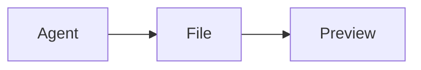

# 轻量 Asset Preview v4

> 状态：v4.1。在 v4 单文件 Preview 与 E2EE 边界上，聊天/文档 Markdown 于渲染期绑定 Preview URL（不再向 Agent 注入部署前缀），HTML Viewer 对静态相对资源做 Blob 重映射。真 WebRoot HTTP origin、大文件和公开 Assets Gateway 仍不在本版本内。

## 1. 产品结论

Asset Preview 是给人和 Agent 快速打开 workspace 文件的轻量查看器：

- 唯一入口是 daemon 已注册项目中的 **`<rootHandle>/<recursive-relative-path>`**。同一物理目录在 folder 和任意 `.code-workspace` 项目中复用同一个 device-local root handle；folder label 只用于显示。
- URL 明文包含稳定 device handle、workspace handle 和相对路径；路径不是秘密，也不是授权凭证。
- 同一个 URL 可在另一台已配对电脑或手机浏览器打开。查看设备不需要安装 daemon；它只需能够加载工作台并持有本地配对凭证，或已登录有权访问该设备的托管账号。
- 文件由资源所在设备的 daemon 读取，经已有 E2EE Data Plane 返回；Fabric Relay 不解析或解密内部 Preview request、MIME 与文件 bytes。URL locator 本身是明文产品地址，工作台 HTTPS 终止层会看到它，这与“不隐藏设备路径”的产品取舍一致。
- 只返回完整原文件。源文件 `<= 4 MiB` 才成功，超过直接提示无法预览。
- 支持图片、Markdown、任意有效 UTF-8 且不含 NUL 的文本、单文件 HTML、MP4/WebM 小视频；已知源码/配置格式尽可能语法着色。
- HTML 可运行 inline/HTTPS script 并访问 HTTPS/WSS 网络，但位于无同源权限的 sandbox iframe 中，不能取得工作台权限。
- 点击文件在独立页面打开。HTML 支持静态多文件（Blob 重映射）；浮窗 iframe 与真 WebRoot HTTP origin 留到后续。
- `file.read` 已删除，文件查看器统一使用 Preview；写文件仍是独立业务能力。

v4 明确不做缩略图、摘要、截断、转码、poster、probe、Range、缓存、上传 bytes、HTTP URL、Git object、多文件 HTML 目录映射、Service Worker 或 daemon HTTPS。Agent artifact 仍是 workspace 普通文件；本版本只让 Agent 按统一 locator 输出链接，没有新增 artifact 存储。

## 2. 规范 URL

```text
https://<workbench-origin>/<deployment-base>/assets/preview/v2/
  <deviceHandle>/<projectHandle>/<rootHandle>/<recursive-relative-path>
```

例子：

```text
https://app.example/assets/preview/v2/dev_7k2/ws_docs/r_a81f/docs/architecture.png
https://app.example/console/assets/preview/v2/dev_7k2/ws_docs/r_a81f/reports/result.md
```

真实 URL 不换行。`deployment-base` 来自前端构建的 base path，因此根部署和 `/console/` 等子路径部署都能 deep-link。

URL 中的 `/v2/` 是 locator contract 版本，不跟随 Viewer UI 迭代。旧 `/v1/` 把可变 folder label 当作多根前缀，不能安全解释为新 locator，因此没有运行时 fallback。

这三个 locator 都是可见的：

- `deviceHandle`：daemon 拥有的稳定设备句柄；不是用户输入的展示名。
- `projectHandle`：该连接可解析的项目 locator。直接打开 folder 与打开 `.code-workspace` 使用不同、可恢复的持久 ID；workspace-scoped hosted route 可使用 Control 分配的外部 handle。
- `rootHandle`：daemon 配置中持久化的随机 device-local 目录句柄。映射独立于项目，同一 canonical directory 在该 daemon 的配置生命周期内复用同一 handle；项目授权只依据成员关系。
- `path`：相对该 root 的规范递归路径，例如 `docs/readme.md` 或 `src/main.ts`，深度没有业务层限制，总 URL 仍受 4096 UTF-8 bytes 上限约束。

`.code-workspace` 读取 [VS Code multi-root workspace schema](https://code.visualstudio.com/docs/editing/workspaces/multi-root-workspaces#_workspace-file-schema) 的 `folders[].path/name` 子集：支持 JSONC/JSON5 注释、尾逗号，以及相对 workspace 文件或绝对的本地路径；`settings`、`extensions` 等字段不参与 GeneHub 行为。MVP 不接受 `uri`/remote root，最多 32 个根，定义文件最多 1 MiB。Explorer 按文件顺序显示每个根；Agent、会话存储、终端和 Git 始终使用第一个根，只有文件树、`file.write` 与 Asset Preview 使用全部根。

URL **不是 capability**。仅知道或转发 URL 不会获得文件：Viewer 必须重新取得目标 endpoint/route，并以当前浏览器已有的配对 credential 或账号 session 完成 peer authentication。daemon 最终再次校验 project scope、root membership 和递归 path。

前端统一使用：

```ts
assetPreviewUrl(deviceHandle, projectHandle, `${rootHandle}/${relativePath}`)
parseAssetPreviewPath(location.pathname)
```

FilesPanel、Agent 输出和聊天链接应共享这个 builder，不能手拼 URL。解析器要求 percent-encoding canonical round-trip，拒绝 encoded slash、空 segment、`.`、`..`、反斜杠、NUL、drive/ADS 冒号和平台尾随点/空格。相对 path 最多 4096 UTF-8 bytes；device/workspace segment 最多 256 字符。

## 3. 打开流程

```text
用户点击规范 URL
  │
  ├─ Viewer 解析 device/workspace/path
  ├─ Host.targets() 按 deviceHandle 找目标
  ├─ Host.openTarget() 获取新 endpoint + one-use route admission
  ├─ Client 完成 v3 peer authentication
  ├─ 校验 daemon 返回的 machineId == URL deviceHandle
  └─ 发起 asset.preview Exchange
         └─ daemon 校验 workspace/path、完整读取、返回 bytes
```

Cloud console 在入口就识别 Preview deep link，并使用账号机器列表或浏览器本地 pairing roster 解析设备；不要求先进入 workbench 选择机器。连接重建会重新签发 one-use Fabric endpoint/route ticket，不复用已消费票据。

独立 Viewer 为本次预览创建自己的 `Client`。页面卸载会关闭该 client、所有在途 stream 和 RTC/Fabric carrier，并释放 Blob URL。它不依赖另一个 tab 中已存在的 JS connection，因此链接可以复制到已授权的其他设备。

## 4. Exchange 契约

Preview 只是通用 v3 Exchange method，不定义新的 transport：

```text
RequestHead {
  version: 3,
  method: "asset.preview",
  metadata: {
    source: {
      kind: "workspaceFile",
      workspaceHandle,
      path
    }
  },
  bodyLength: 0,
  timeoutMs: 15000
}
FIN

ResponseHead {
  status,
  metadata: {
    kind?, mediaType?, sourceBytes?, version?,
    error?: notFound | forbidden | unsupported | tooLarge | sourceChanged,
    limitBytes?: 4194304
  },
  bodyLength
}
DATA*
FIN
```

method、metadata、status 和 body 都在 E2EE record 内。body 是 streaming bytes，不经过 JSON/base64；DataEndpoint 自动切成最多 16 KiB record 并与其他 logical streams 公平轮转。

请求没有 body。成功 response 的 `bodyLength`、`sourceBytes` 和实际收到的 bytes 必须完全相等且不超过 4 MiB，否则 Viewer fail-close 当前 stream。失败 response body 必须为空。

`source.kind` 在 MVP 只有 `workspaceFile`。未来若支持 artifact、Git revision 或生成文档，应新增明确 contract，而不是让 `path` 指向 workspace 外资源。

## 5. daemon 文件边界

```text
MAX_PREVIEW_SOURCE_BYTES = 4 * 1024 * 1024
PREVIEW_WORKERS = 2
PREVIEW_TIMEOUT = 15 seconds
```

daemon 的顺序是：

1. 校验 canonical root-qualified path。
2. 校验 route 限定的 project handle；解析为 daemon-local project id。
3. 用首段查 daemon 级 root mapping，并确认该 rootHandle 是当前项目成员；再以对应 capability directory API 打开余下递归相对路径。
4. 要求目标是普通文件；不把目录、FIFO、设备或 socket 当文件流。
5. 先读 metadata。大于 4 MiB 直接返回 `tooLarge`，不开始传输。
6. 最多读取 `4 MiB + 1`；增长越界返回 `tooLarge`，长度变化返回 `sourceChanged`。
7. 图片/视频按扩展名 + magic 判定；Markdown/HTML 按扩展名 + UTF-8 判定；其他有效 UTF-8 无 NUL 内容作为安全文本。
8. 对完整 bytes 计算截短 SHA-256 version，发送精确 response head 和 body。

文件读取在 `spawn_blocking` 中执行，最多两个并发 Preview worker；它不占 carrier reader 或 DataEndpoint writer task。handler 等待 worker 时只占自己的 logical stream。

路径边界使用 `cap-std::fs::Dir` 相对于已验证 workspace root 打开，并有 symlink escape 测试。绝对路径、`..`、编码分隔符和平台歧义 spelling 在 URL 层与 daemon 层分别拒绝，不能依赖前端校验作为安全边界。

## 6. 类型 allowlist

成功响应只产生以下组合：

| kind | mediaType | 识别规则 |
|---|---|---|
| `image` | `image/png` | `.png` + PNG signature |
| `image` | `image/jpeg` | `.jpg/.jpeg` + JPEG signature |
| `image` | `image/gif` | `.gif` + GIF87a/GIF89a |
| `image` | `image/webp` | `.webp` + RIFF/WEBP |
| `video` | `video/mp4` | `.mp4` + `ftyp` box marker |
| `video` | `video/webm` | `.webm` + EBML marker |
| `markdown` | `text/markdown` | `.md/.markdown/.mdown` + valid UTF-8 |
| `html` | `text/html` | `.html/.htm` + valid UTF-8 |
| `text` | `text/plain` | 其他扩展名 + valid UTF-8 + 无 NUL |

文本中任意位置含 NUL 或 UTF-8 非法时拒绝。daemon 不相信浏览器传来的 MIME，也不做可执行的通用 MIME sniffing；未知扩展名只要满足文本判定就作为转义文本显示。图片/视频仍必须同时匹配扩展名与 magic；否则若 bytes 本身是文本就降级为文本，其他二进制返回 `unsupported`。

## 7. 浏览器渲染

### 图片与视频

Viewer 用完整 bytes 创建带 daemon allowlist MIME 的 Blob URL。图片使用 ``，MP4/WebM 使用带 controls 的 `<video>`。没有 Range 和转码，因此 4 MiB 上限同时控制内存和首屏等待。

### Markdown 与文本

Markdown 使用 `react-markdown` + GFM，不启用 raw HTML。document 变体有完整标题层级、列表/任务列表、引用、表格、inline code、代码块复制与常用语言语法着色；未知语言由 highlighter 自动识别，单块超过 256 KiB 时回到已转义纯文本，避免高亮器独占主线程。普通文本复用同一高亮组件：按文件名/扩展名推断常见源码、配置、构建和脚本语言，未知格式自动检测，始终先转义再显示，并拥有独立双向滚动容器。

````markdown

````

`mermaid` fence 按需加载独立 bundle，普通 Markdown 不加载它。输入最多 128 KiB，`securityLevel=strict` 且禁用 HTML label；输出再次移除 script、foreignObject、image、link 与事件属性，最后作为 Blob SVG `` 显示，而不是把活动 SVG 注入工作台 DOM。Markdown 作者声明图片不会自动联网；普通链接只在用户点击后以独立 tab 和 `noopener/noreferrer` 打开。

Preview 页根容器显式占满固定的 `body/#root`，只有正文 pane 使用 `overflow-y:auto`，因此长文档在手机和桌面都可滚动，工作台 chrome 不参与滚动。

### 活动单文件 HTML

HTML 在 `iframe srcdoc` 中运行：

```html
<iframe
  sandbox="allow-scripts"
  referrerpolicy="no-referrer"
  srcdoc="..."
/>
```

关键边界：

- 没有 `allow-same-origin`，document 是 opaque origin，不能读父页面 DOM、cookie、localStorage、IndexedDB 或 GeneHub credential。
- 没有表单、弹窗、top navigation、下载、摄像头、麦克风、定位、剪贴板、USB、串口或 worker 权限。
- Viewer 删除源文件自带 `<base>` 和 CSP，插入固定 `https://preview.invalid/` base 与自己的 CSP。
- 允许 inline script/style，以及绝对 HTTPS script/style/image/media/font 和 HTTPS/WSS connect。
- 禁止 object、嵌套 frame、worker、form action；相对资源会指向不可用的固定 base，不会隐式读取 workspace 邻接文件。
- UI 明示“活动 HTML · 网络已开启”。

`srcdoc` 会继承承载 Preview 页面的 HTTP CSP；iframe 内的 `<meta>` 只能继续收紧，不能放宽它。因此生产 edge 必须只对 `/assets/preview/v2/*` 页面提供上述 active-HTML CSP，并让普通工作台继续使用不含 `unsafe-inline` 的严格策略。Cloud 的 Caddy 配置已按路径分开；自托管若统一下发 `script-src 'self'`，HTML 文档能显示，但其中脚本会被浏览器阻止。这是部署契约，不能靠在 iframe 内插入另一条 CSP 绕过。

“允许网络”是产品取舍：HTML 本身可向互联网发送它已经拥有的文件内容，所以用户不应把不可信 HTML 当成静态文档；但 sandbox 隔离保证它不能因此取得 GeneHub 页面或其他本地文件的权限。未来若提供无网络模式，应是显式渲染模式，不与当前契约混淆。

## 8. 多文件 HTML 为什么不在 MVP

相对 URL 需要一个可解析的目录命名空间；单次 E2EE Exchange 只返回一个文件，浏览器不会自动把 iframe 的后续 HTTP 请求映射回 daemon。正确方案需要 WebRoot session、受限资源路由、生命周期、缓存/Range 和更细的 path policy，或 daemon HTTPS + 字节隧道。

MVP 的固定 base 会让相对 CSS、JS、图片和模块 import 明确失败，而不是悄悄发起新的未授权 workspace read。多文件站点应使用 [云端 Assets Gateway](./assets-cloud-gateway.md) 或 [daemon HTTPS + SNI 字节隧道](./assets-daemon-https-sni-tunnel.md) 的后续提案；不引入 Service Worker。

## 9. 错误与用户提示

| error | HTTP-like status | UI 含义 |
|---|---:|---|
| `notFound` | 404 | 找不到文件 |
| `forbidden` | 403 | workspace/path 不在当前授权内 |
| `unsupported` | 415 | 类型不在 allowlist |
| `tooLarge` | 413 | 超过 4 MiB，不预览 |
| `sourceChanged` | 409/500/408 | 读取期间变化、worker 异常或超时，请重试 |

连接未配对、设备离线、URL 设备与握手身份不一致、版本不兼容和 E2EE 认证失败使用连接层错误，不伪装成文件不存在。协议版本不匹配直接关闭，不尝试旧 `file.read`。

## 10. v3 文件界面、多根工作区与 Agent 链接

FilesPanel 把目录和文件交互彻底分开：文件才打开 Preview，目录只在当前树中展开。每次打开 Files pane 都重新获取 root；窗口重新获得焦点/可见性时自动刷新，并提供明确的“刷新”按钮。root 刷新后，仍处于展开状态的目录会重新获取自己的 subtree，不会把整个工作台导航到目录 URL，也不会永久停在“载入中”。

协议中的折叠目录以**缺失 `children`**表示，而不是 `children: null`；Web 仍归一化旧 daemon 的 null。这个边界有协议序列化和整页组件两层回归测试：旧实现点击真实目录后执行 `null.map()`，React 因未捕获 render error 卸载整个工作台，正是“全 page 都没了”的根因。

打开项目入口同时接受普通目录和 `.code-workspace`。远端目录浏览器列出子目录及当前目录中的 workspace 文件；桌面原生壳提供相邻的“打开项目文件夹”和“打开工作区”动作。两种来源即使第一根相同也拥有独立项目 ID；多根 Explorer 顶层仍显示各 `folders[].name`，但节点 path 始终带全局 `rootHandle`。daemon 在每次 tree/write/preview 时重新验证项目成员关系并解析到 capability root，label、排序和重名不参与寻址。

Agent 不必输出部署相关的 Preview prefix。聊天与文档 Preview 共用 Markdown 渲染器，在展示时把下列引用解析为当前 device/project/root 的 Preview URL：

- 相对 Agent cwd（第一根）的路径，例如 `reports/a.md`
- 落在已注册 root 下的绝对文件系统路径
- 已是 `/assets/preview/v2/...` 的旧链接（保留 path，重绑当前 device/project）
- Markdown 图片的相对/绝对本地路径：经 `asset.preview` 鉴权加载为 blob，外链图片仍阻断

`session.send` 的 `artifactPreviewBaseUrl` 仍保留在协议中以兼容旧客户端，但当前工作台始终传 `null`，daemon 不再把它注入 adapter system prompt。

HTML 预览在 Viewer 内对入口文件做静态依赖 Blob 重映射（`link`/`script`/`img` 等相对引用与 CSS `url()`）；CSP 允许 `blob:` 的 script/style/font。动态 `fetch`/import、根路径 `/...` 与 WebRoot HTTP origin 仍不在本版本内。

## 11. 验收

- URL 可 round-trip Unicode、空格和部署子路径；拒绝 traversal、encoded slash、反斜杠和非 canonical encoding。
- FilesPanel 用当前 daemon identity + workspace id + 相对 path 生成独立 Viewer URL。
- Cloud 根入口可直接渲染 Preview deep link，并按 URL device handle 找账号或本地 pairing target。
- 两台独立已配对客户端能用同一 locator 通过真实 self-hosted Relay/daemon 读取相同 bytes。
- 文件恰好 4 MiB 成功，4 MiB + 1 byte 明确 `tooLarge`；没有截断或 overview。
- 目录只展开不导航；重新打开、回到页面或按刷新均能看到新文件，展开目录在 root refresh 后自行恢复。
- 真实 wire 的折叠目录字段缺失；旧端的 `children:null` 也只触发展开请求，不会卸载页面。
- `.code-workspace` 的注释、尾逗号、相对/绝对本地 path、folder name 和重复显示名称可用；URI root、重复目录、越界路径、超量定义明确拒绝。
- folder 与 `.code-workspace` 项目 ID 独立；同一 canonical directory 跨项目复用全局 rootHandle。改 label、调顺序不会改变资源 locator。
- 多根 tree/write/Preview 都按 `rootHandle` 到达正确 capability root；Agent/session/terminal/Git cwd 仍是第一根。
- 长 Markdown 可滚动，GFM/inline code/fenced code 高亮和安全 Mermaid 流程图可用。
- 任意有效 UTF-8 无 NUL 文件可读；已知源码/配置/构建格式按路径着色，未知文本自动识别或安全退化为转义纯文本。
- 聊天/文档 Markdown 把相对路径、绝对路径和旧 Preview URL 解析为当前绑定；外链图片仍阻断，本地图片经鉴权 blob 显示。
- `session.send` 不再注入 Preview URL system prompt。
- allowlist、UTF-8、magic、普通文件和 symlink escape 均有 daemon 测试。
- 成功 response 精确校验三处长度；取消、超时和页面关闭能释放 stream/client/Blob。
- HTML script 可运行，静态相对 CSS/JS/图片可经 Blob 重映射加载，网络策略可见，父页面同源权限不可得；动态加载与根路径站点仍不可用。
- `file.read`、`FileContent` 和旧查看器没有运行路径或 fallback。
