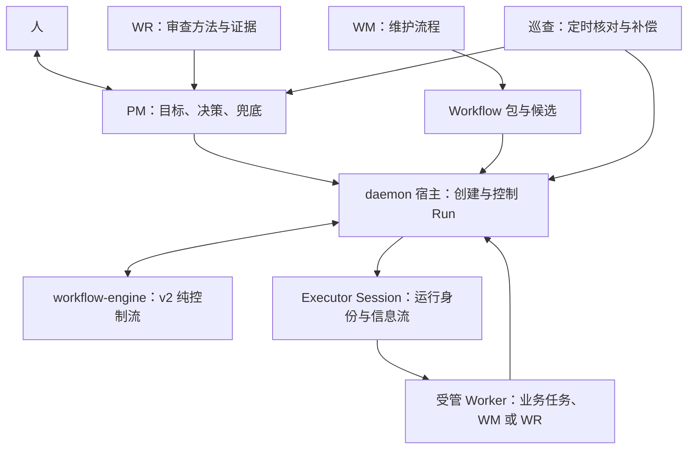

# 角色与执行模型

[文档入口](README.md) · [运行控制](runtime.md) · [包与候选](packages.md)

PM 对人的目标负责；WM 维护执行方法；WR 独立审查方法；Worker 完成具体任务。workflow-engine 与 daemon 宿主提供程序化执行，通过 Executor 接入 AgentSpace/Session。巡查持续核对执行事实和目标的后续责任。

## 职责与机制

| 对象 | 性质 | 当前职责 |
| --- | --- | --- |
| PM | 项目经理智能体 | 理解目标、约束和后续纠正；选择并委托流程；管理资源和授权；决定采用、继续、交付或人工处置；异常时接管 |
| WM（Workflow Manager） | 流程维护智能体 | 创建或修改项目流程、角色和提示词，提出 Skill/载体准备与验证方案；默认返回未激活候选供 PM 决定 |
| WR（Workflow Reviewer） | 流程审查智能体 | 对照原始意图和执行证据审查流程、协作和方法变更，区分事实、推断、缺证及建议 |
| Worker | 节点执行身份 | 按节点输入执行具体任务并提交结果；Coder、业务 Reviewer、WM、WR 都可以作为受管 Worker |
| workflow-engine | 纯程序内核 | 编译 v2 结构化流程，按事件和版本推进状态，返回待执行操作；不访问文件、启动进程、调用模型或持有系统时钟 |
| daemon workflow 宿主 | 程序执行与控制 | 保存状态、路由 Agent、创建会话、执行宿主能力、取得租约、接收结果、清理进程并落实权限和预算 |
| Executor | 执行组件及实例化机制 | 把 Workflow 运行接入 Space/Session，绑定 Run、直接 Worker 和结构化信息流；正常控制流不消耗 Executor LLM 回合 |
| 巡查 | daemon 定时机制 | 核对未结束需求及相关执行，推进与补偿可机械处理的状态，通知 PM 并按条件启动恢复流程 |

WR 审查执行方法；游戏是否可玩、功能是否满足业务验收由相应业务 Reviewer 判断。WM 与 WR 平级协作，PM 决定下一步。流程自身可以包含有限修复和重规划，普通阶段切换不需要 PM 逐项派发新 Run。

## Space、组件、Session 与 Run

这四类身份不能都简称为“Executor”。

| 身份 | 含义与寿命 |
| --- | --- |
| AgentSpace | 可配置的能力与资源容器，包含目录引用、组件和 Skill，可有多个 Session |
| Component | 挂在 Space 上的职责；`pm`、`executor`、`worker`、`reviewer` 可组合，并非互斥 Space 类型 |
| Session / Component Instance | Space 在一次会话中的实例；组件从 Space 当前配置派生，组件可有 Space 级与会话级存储 |
| Run | 一次固定定义、候选、输入和执行绑定的运行；节点状态与 FlowMessages 的权威记录由 daemon 持久化 |

正常包派发选择 Executor Space，并创建一个绑定该 Run 的 Executor Session。`session.flow` 要求这类会话恰好对应一个 Run。一个项目可有多个 Executor Space，同一 Space 可承载多次执行实例；实际并发仍受流程、资源、租约和预算约束。

Parent 表达归属，executor 组件表达调度职责。Executor 只调度直接挂载且启用的 Worker，不越过子团队边界。Worker Agent 在自己的 `session_cwd` 启动以加载自身配置，在节点绑定的 `task_cwd` 处理任务。

内置 WM Space 同时挂载 worker 与 executor，表示组件可组合；**当前公开 `workflow dispatch` 仍拒绝所有受管子会话**。因此不能由组件存在推断 WM 已能递归启动 Workflow。包的顶层载体是挂 executor 且不同时挂 worker 的 Space；声明多个顶层载体会报歧义。

定义包可以复用已登记载体。没有载体时，宿主保留在项目 Workspace 创建受管 Worker 的执行路径。内置恢复明确使用该路径，不创建正常的 Executor Session，也不要求损坏的项目团队仍可用。

## 执行分层

图表示职责关系，具体进程和调用均由宿主落实。当前只接受 v2，经 `structured.rs` 接入独立内核；v1 图执行与迁移路径已退役。节点能力如 `agent.session`、`pack.script`、`result.publish`、`request.budget` 属于宿主，不能写成纯内核的 I/O 能力。

当前巡查与执行推进共用 `control::maintain` 循环，包括 `finish_nodes`、`structured::drive` 和 `reconcile`。职责可以分别解释，代码并没有两个独立调度服务。

## 目标、执行与对话分别结束

用户需求是 PM 持续负责的目标及约束，可关联多次业务 Run、恢复 Run 和后继。源码中的 `request`、`requestRunId` 与磁盘 `requests/` 是这个记录的技术名称，不等于 HTTP 请求或一条聊天消息。

- Worker 回合结束，不代表节点结果已提交。
- 节点完成需要所属 Worker 的受控提交及进程/资源收尾。
- Run 完成说明本次执行结束，不代表用户目标已交付。
- PM 核对原目标、后续要求和业务证据后，通过 `workflow deliver` 明确记录需求交付。
- 消息 `accepted` / `handled` 只说明接收或处理，不能替代交付决定。

需求与 Run 状态在 PM Space 的 `components/pm/requests/` 下保存；Executor 会话展示这些事实，不拥有另一份权威运行快照。候选与激活指针属于 executor 组件的 Space 级存储。物理路径以[存储规范](../storage-layout.md)为准。

## 权限与职责的区别

PM 的管理能力来自已授权项目及调用者身份；异常兜底额外依据 daemon 记录的故障事实，在故障解除后撤回。它不允许跨项目控制、代替其他 Worker 交卷或代答真实 Human 授权。

同项目的受管 `workflow-manager`、旧名 `wm` 与内置 `recovery-manager` 可以通过维护入口修改 Workflow 配置；还要通过各操作的版本、状态和授权检查。内置 WM 方法默认返回候选，显式委托才应用配置，PM 保留采用决定。该维护入口是现有生命周期接口共用的权限检查，并非独立的文件写权限系统。

WR 的只读是角色职责约定。`userInteraction: readOnly` 限制人直接改写受管会话，不限制 Agent 文件工具。当前角色按标签路由 Agent，`evidenceOnly` 不再参与工具收窄或路由准入。保留的 `diagnostic` 组件标记只为兼容已安装的 Space；它不再驱动独立自动诊断。

实现入口：[组件与归属](../../apps/daemon/src/agent_space.rs)、[会话组件实例](../../apps/daemon/src/session/components.rs)、[宿主](../../apps/daemon/src/workflow/mod.rs)、[权限](../../apps/daemon/src/router.rs)。

## 可观测与优化

Workflow Builder 校验控制流、内联规范并冻结视图文件；内置视图无需 Node 构建工具。
`workflow profile --run <id>` 按请求读取 Run、Worker 活动与成本快照，返回基础事实和缺失来源，
不在 daemon 维护关键路径或质量结论。`--compare <id>` 提供两份请求事实供 WM 比较。
模型成本统一按 LLM 调用次数和五档人民币单价估算，执行时固定单价；未计价调用明确显示。

包可以用脚本记录依赖、排队、工具内部步骤，并在自己的 UI 中计算关键路径与余量。
需求项、产品规范和工程规范的适用范围、验收出口和交付门禁完全由包定义。
WM 同时维护流程、提示词和视图，比较等价材料上的质量、时间与成本；WR 负责运行健康下限，
PM 传递目标与质量底线，不把平台接口缺口变成要求用户放宽目标的选择。
